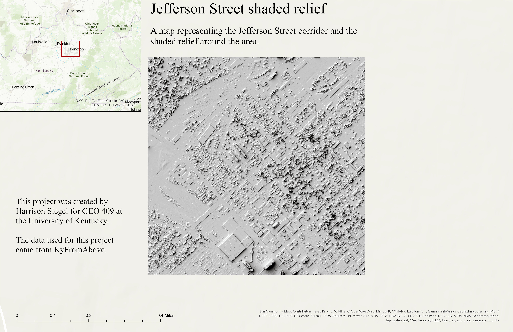

# *Jefferson shaded relief*
## lat(38.053480) and lon(-84.500871)

This area is located in the Jefferson Street corridor in Lexington, Kentucky. The image includes the surrounding areas of Jefferson Street such as Rupp Arena and Downtown.

*Jefferson Street*

[Link to high-resolution version](Layout.pdf)

This map was created by Harrison Siegel, a student at the University of Kentucky. The data used for this map was sourced from Kentucky From Above. The process of this map included setting an AOI, using DSM data, creating hillshade data, altering data for blender, utilizing blender, and creating a layout on ArcGIS.